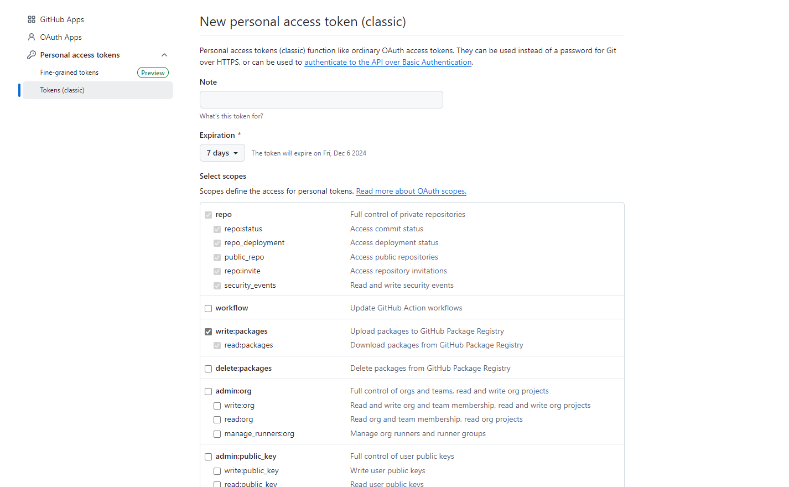

# Module 0: Prerequisites and Introduction

Welcome to Module 0 of our course! Before we dive into the content, it's important to ensure that your environment is properly set up. This module provides instructions for preparing your system with the required tools and resources.

---

## Prerequisites

To successfully complete this course, you need to have the following:

### 1. An Active Azure Subscription
- If you don’t already have an Azure subscription, you can sign up for a free account at [Azure Free Account](https://azure.microsoft.com/free).
- Ensure your subscription is active and that you have access to the Azure portal.

### 2. Install Git on Your Machine
Git is required for version control and working with repositories. Follow the instructions below to install it on your operating system:

- **Windows**: Download the Git installer from [Git for Windows](https://git-scm.com/download/win) and follow the installation wizard.
- **MacOS**: Use Homebrew with the command:
  ```bash
  brew install git
  ```
- **Linux**: Use your package manager, for example:
  ```bash
  sudo apt install git       # For Debian/Ubuntu
  sudo yum install git       # For CentOS/RedHat
  ```

To verify the installation, run:
```powershell
git --version
```

### 3. Install Azure CLI
Azure CLI is essential for managing Azure resources from the command line. Install it using the instructions below:

- **Windows**:
  - Download the installer from [Install Azure CLI](https://learn.microsoft.com/en-us/cli/azure/install-azure-cli-windows?tabs=azure-cli).
  - Run the installer and follow the prompts.

- **MacOS**:
  - Use Homebrew:
    ```bash
    brew install azure-cli
    ```

- **Linux**:
  - Use the following commands:
    ```bash
    curl -sL https://aka.ms/InstallAzureCLIDeb | sudo bash  # For Debian/Ubuntu
    sudo rpm --import https://packages.microsoft.com/keys/microsoft.asc
    sudo dnf install azure-cli                             # For CentOS/RedHat
    ```

To verify the installation, run:
```powershell
az --version
```

 **Login to your Azure account and select your subscription**
   
  - Login to your Azure Subscription

```powershell
az login
```

 **Select your subscription by typing the number assigned to it**
### 4. Create a Github Token (PAT)

First you need to create your own **public repository** in [Github](https://github.com/{Owner}/{Repo})

- Select **Create a new repository** from **Use this template** button


- Fill in **Repository name** field with a name and click **Create repository**.


- Using [Github](https://github.com/), log in to your account, or create a new one if you don’t already have one.
- After signing in, click your profile picture in the top-right corner and select Settings from the dropdown menu.
- Scroll down and click Developer settings on the left-hand side.
- Under Personal Access Tokens, select Tokens (classic) and click Generate new token.
- Set the token to expire in 7 days.
- Check the boxes for repo and write:packages permissions.



- Click Generate token and save the token securely—it will be used later in the course.

### 5: Install Visual Studio Code

For this course, we recommend using **Visual Studio Code** as your text editor. It's lightweight, highly customizable, and offers excellent support for coding.

#### 5.1 Download Visual Studio Code
1. Visit the [Visual Studio Code official website](https://code.visualstudio.com/).
2. Click the download button for your operating system (Windows, macOS, or Linux).

#### 5.2 Install Visual Studio Code
1. Once the download is complete, open the installer:
   - **Windows**: Double-click the `.exe` file and follow the installation wizard.
   - **macOS**: Open the downloaded `.dmg` file, drag the Visual Studio Code icon to your `Applications` folder.
   - **Linux**: Follow the instructions provided for your distribution on the download page (e.g., using `deb` or `rpm` packages).

#### 5.3 Launch Visual Studio Code
- Open Visual Studio Code after installation:
   - On **Windows** or **macOS**, find it in your Start Menu or Applications folder.
   - On **Linux**, use your system launcher or run `code` from the terminal if added to your path.

#### 5.4 Configure Visual Studio Code for PowerShell Scripts
Visual Studio Code will be used in this course to run PowerShell (`.ps1`) scripts line by line.

1. Install the **PowerShell Extension**:
   - Open Visual Studio Code.
   - Click the **Extensions** icon on the left sidebar or press `Ctrl+Shift+X` (`Cmd+Shift+X` on macOS).
   - Search for **PowerShell** and click **Install**.

2. You can now run individual lines or blocks of code by selecting them and pressing `F8`.

3. Tip for Previewing Markdown in VS Code:

To preview your Markdown file in **Visual Studio Code**, press `Ctrl + K, then V`. This will open the preview pane, allowing you to see the rendered version of your Markdown file.

---

#### 5.5 Clone your Github repository

1. From **Source Control** tab select **Clone Repository** and follow the prompts to authenticate with GitHub in the browser and return to VS Code.
2. From the GitHub repository dropdown you can filter and pick the repository you want to clone locally, select yours.

## Next Steps

Once you have completed the prerequisites:
1. Confirm that you can access the Azure portal with your subscription.
2. Verify that Git and Azure CLI are properly installed and accessible from your terminal.
3. Make sure that Visual Studio Code and the Powershell extension are installed and you can run them.


If you encounter any issues, please reach out to the course instructor or consult the provided documentation.

Happy Learning!

---
