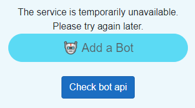

## Exercise 2

### Simulate a server failure
1. In the Azure Portal, access the resource where the BotAPI is deployed.

2. Stop the resource from running to simulate a server overloading/failing.
> [!IMPORTANT]
> You need to stop both resources that you deployed for this exercise. Stopping only the main one will make the Azure Front Door to redirect to the other resource.

3. Try to play a game by inviting a bot. You won't be able to play the game as the bot you invited will never join. On a large scale application, this will mean that the users will flood the server with requests that the server won't be able to respond to.

 In order to solve this problem, we will use a **Circuit Breaker** pattern inside our web application so after a few failed requests, the clients will limit the rate of sending additional requests to the server.

 To solve this exercise you can either implement the Circuit Breaker yourself, or deploy the provided app with the implementation.

 ### **Method 1**: Implementing the [Circuit Breaker](https://learn.microsoft.com/en-us/dotnet/architecture/microservices/implement-resilient-applications/implement-circuit-breaker-pattern) pattern

1. First, clone the repository on your local machine. You will find the source code of exercise 1 and the start of exercise 2 at `src/Module1/Exercise_1-2_Start`.

2. Install the [Polly](https://www.nuget.org/packages/polly/) NuGet package in the RockPaperScissors project, so that you'll be able to implement the Circuit Breaker.

3. Inside the same project, open Services/BotService.cs. This will be where you will implement the logic for the Circuit Breaker.

4. You should modify the code in the BotService class in order to implement the Circuit Breaker. It should look something like this:

````c#
public class BotService : IBotService
{
    private readonly HttpClient client;
    private readonly AsyncCircuitBreakerPolicy<HttpResponseMessage> _circuitBreakerPolicy;
    public bool IsCircuitOpen { get; private set; }
    public string ErrorMessage { get; private set; } = string.Empty;

    private IConfiguration configuration;
    public BotService(HttpClient client, IConfiguration configuration)
    {
        _circuitBreakerPolicy = Policy
            .Handle<HttpRequestException>()
            .OrResult<HttpResponseMessage>(response => !response.IsSuccessStatusCode)
            .CircuitBreakerAsync(
            handledEventsAllowedBeforeBreaking: 2,
            durationOfBreak: TimeSpan.FromSeconds(30),
            onBreak: (result, duration) =>
            {
                IsCircuitOpen = true;
                ErrorMessage = "The service is temporarily unavailable. Please try again later.";
            },
            onReset: () =>
            {
                IsCircuitOpen = false;
                ErrorMessage = string.Empty;
            },
            onHalfOpen: () =>
            {
                ErrorMessage = "Circuit is half-open; testing the next call.";
            }
        );
        this.client = client;
        this.configuration = configuration;
    }

````
5. Now you should also modify the CheckBotAPI method so that the http call will be made using the Circuit Breaker
````c#
public async Task<HttpStatusCode> CheckBotAPI()
{
    try
    {
        var response = await _circuitBreakerPolicy.ExecuteAsync(async () =>
        {
            var url = configuration["BOTAPI_URL"];
            var result = await client.GetAsync($"{url}/api/Bot/check");
            result.EnsureSuccessStatusCode();
            return result;
        });
        var data = await response.Content.ReadFromJsonAsync<HttpStatusCode>();
        return data;
    }
    catch (Exception ex)
    {
        return HttpStatusCode.ServiceUnavailable;
    }
}
````
6. Now you will have to change the code in the Pages/CreateSession.razor page, in order to show the functionality of the circuit breaker.

````cshtml
@page "/createsession"
@using RockPaperScissors.Models
@using RockPaperScissors.Services
@using System.Web
@using System.Net
@inject NavigationManager Navigation
@inject ISessionService _sessionService
@inject IBotService _botService
@inject Session GameSession
@inject IJSRuntime JS
<PageTitle>Create Game Session</PageTitle>

<div class="full-page-container" style="background-color: #87ceeb; position: relative; min-height: 100vh; display: flex; justify-content: center; align-items: center;">
    <div class="text-center p-5 rounded" style="background-color: rgba(255, 255, 255, 0.85); box-shadow: 0 4px 8px rgba(0, 0, 0, 0.1); width: 400px;">

        <div class="d-flex justify-content-between align-items-center w-100 p-4" style="position: absolute; top: 0; left: 0; right: 0;">
            @if (!string.IsNullOrEmpty(Player1.Name))
            {
                <h2 class="text-dark" style="font-family: 'Comic Sans MS', cursive; font-size: 1.5rem;">Welcome, @Player1.Name!</h2>
            }
        </div>

        <h1 class="mb-4" style="font-family: 'Arial Black', sans-serif; color: #2e8b57;">Create Game Session</h1>

        <div class="mb-4">
            <button class="btn btn-lg btn-warning w-100" @onclick="InviteFriend" style="border-radius: 25px;">🤝 Invite a Friend</button>
        </div>
        @if (inviteLinkCreated)
        {
            <div class="row mb-4">
                <div class="input-group">
                    <input type="text" class="form-control" id="disabledTextInput" value="@inviteLink" disabled>
                    <div class="input-group-append">
                        <button class="btn btn-primary" @onclick="CopyInviteLink" type="button">Copy</button>
                    </div>
                </div>
            </div>
        }
        @errorMessage
        <div class="mb-4">
            <button class="btn btn-lg btn-info w-100" @onclick="AddBot" style="border-radius: 25px;" disabled="@(BotResult!=HttpStatusCode.OK)">🤖 Add a Bot</button>
        </div>
        @if (BotResult == HttpStatusCode.ServiceUnavailable)
        {
        <button class="btn btn-primary mb-4" @onclick="CheckBotAPI" type="button">Check bot api</button>
        }

        <div class="mb-4">
            <button class="btn btn-lg btn-success w-100" @onclick="CreateGameSession" style="border-radius: 25px;" disabled="@(!playerJoined)">🎮 Play</button>
        </div>

        @if (invited)
        {
            <div class="mb-4">
                <button class="btn btn-lg btn-info w-100" @onclick="RefreshStatus" style="border-radius: 25px;">Refresh status</button>
            </div>
        
        @if (playerJoined)
        {
            <div class="alert alert-info" role="alert">
                You can start the game.
            </div>
        }
        else
        {
            <div class="alert alert-info" role="alert">
                You can't start the game until the other player joins the session.
            </div>
        }
        }
    </div>

    <div style="position: absolute; right: 20px; top: 50px; background-color: rgba(255, 255, 255, 0.85); padding: 20px; border-radius: 10px; box-shadow: 0 4px 8px rgba(0, 0, 0, 0.1);">
        <label for="roundsInput" class="form-label" style="font-size: 1.3rem; font-family: 'Arial Black', sans-serif; color: #2e8b57; margin-bottom: 10px; display: block; text-shadow: 1px 1px 2px rgba(0, 0, 0, 0.1);">
            🔢 Number of Rounds (Odd Only):
        </label>
        <InputNumber @bind-Value="numberOfRounds" id="roundsInput" class="form-control" style="font-size: 1.1rem; width: 100px; padding: 10px; border-radius: 10px; border: 2px solid #2e8b57; background-color: #f0f8ff;" min="1" max="10" @oninput="ValidateOddInput" />
        @if (isEvenNumber)
        {
            <div class="text-danger" style="font-size: 0.9rem;">Please select an odd number.</div>
        }
    </div>
</div>

@code {
    private bool inviteLinkCreated = false;
    private string inviteLink = string.Empty;
    private Player Player1;
    private HttpStatusCode BotResult;
    string errorMessage = string.Empty;
    private string sessionId;
    private int numberOfRounds = 3; 
    private bool isEvenNumber = false; 
    private bool playerJoined;
    private bool invited;
    private bool isCircuitOpen = false;

    private SessionStatus status;

    private void InviteFriend()
    {
        inviteLink = $"{Navigation.BaseUri}join/{sessionId}";
        inviteLinkCreated = true;
        invited = true;
        StateHasChanged();
    }

    private async Task CheckBotAPI()
    {
        BotResult = await _botService.CheckBotAPI();
        BotService service = _botService as BotService;
        if(service.IsCircuitOpen)
        {
            isCircuitOpen = true;
            StateHasChanged();
        }
        else
        {
            isCircuitOpen = false;

        }
        errorMessage = service.ErrorMessage;

    }

    protected override async Task OnInitializedAsync()
    {
        GameSession.Player.Choice = null;
        Player1 = GameSession.Player;
        sessionId = Guid.NewGuid().ToString();
        var uri = new Uri(Navigation.Uri);
        GameSession.SessionId = sessionId;
        GameSession.IsInvited = false;
        await _sessionService.CreateSession(Player1.Id, sessionId);
        await CheckBotAPI();
    }

    private async Task RefreshStatus()
    {
        status = await _sessionService.GetStatus(sessionId);
        switch (status.State)
        {
            case SessionState.Created:
            case SessionState.WaitingForPlayer:
                playerJoined = false;
                break;
            case SessionState.WaitingForMoves:
                playerJoined = true;
                break;

        }
    }

    private async Task AddBot()
    {
        await CheckBotAPI();
        if (BotResult == HttpStatusCode.OK)
        {
        await _sessionService.InviteBot(sessionId);

        invited = true;
        StateHasChanged();
        }
    }

    private async Task CreateGameSession()
    {
        await _sessionService.SetNumberOfRounds(sessionId, numberOfRounds);
        Navigation.NavigateTo($"/gamepage");
    }

    private async Task CopyInviteLink()
    {
        await JS.InvokeVoidAsync("clipboardCopy", inviteLink);
    }

    private void ValidateOddInput(ChangeEventArgs e)
    {
        var value = Convert.ToInt32(e.Value);

        if (value % 2 == 0) 
        {
            isEvenNumber = true;
        }
        else
        {
            isEvenNumber = false; 
            numberOfRounds = value;
        }
    }
}
<script>
    window.clipboardCopy = function(text) {
        navigator.clipboard.writeText(text).then(function() {
            alert("Copied to clipboard!");
        })
            .catch(function(error) {
                alert("Error copying text: " + error);
            });
    }
</script>

````
 ### **Method 2**: Use the provided app

If you had trouble implementing the Circuit Breaker, you can use the provided solution instead. You should find it by cloning the repository, under `src/Module 1/Exercise_2_End`.

To be able to deploy the version of the app with the circuit breaker pattern, you need to change the deployment workflow under `./github/workflows`, more exactly, you have to change

`app_location: "/src/Module 1/Exercise_1-2_Start/RockPaperScissors"`

into 

`app_location: "/src/Module 1/Exercise_2_End/RockPaperScissors"`

### Redeploying the app

By pushing any change to the repository, it will trigger the deployment workflow of the web app

### Retrying the app


By trying to add a bot with the new code deployed, you should now be able to see the new check feature.



The "Add a Bot" button will be enabled only when the BotAPI will be up and running.