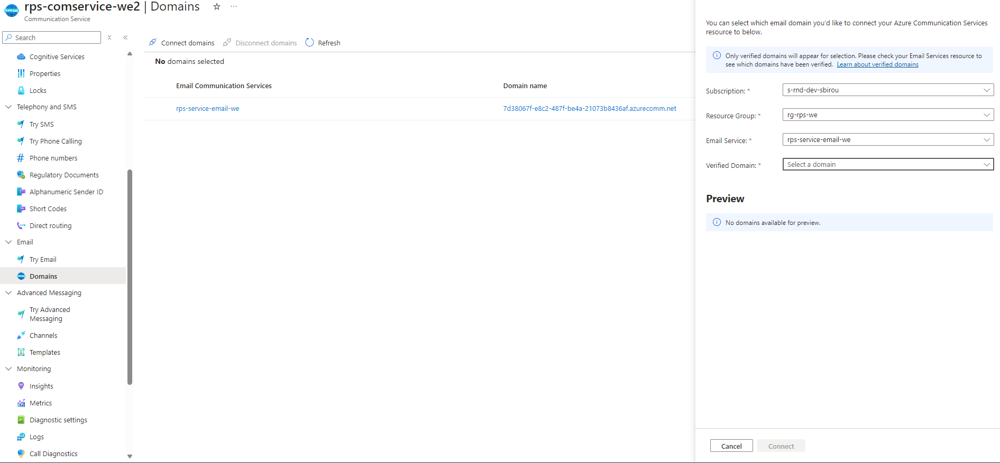

# Module 2: External Communication
This module covers options for managing external communication. Learn about API Gateway, API Management, Azure Front Door, and the use of webhooks for integrating with external systems.

# Exercise 1
In this exercise, you will add real-time functionality to the app by using an [**Azure SignalR**](https://learn.microsoft.com/en-us/azure/azure-signalr/signalr-overview) resource. You will also add an [**Azure Communication Service**](https://learn.microsoft.com/en-us/azure/communication-services/overview) resource for using a SMTP(Simple Mail Transfer Protocol) in order to invite your friends via email and getting notified about session results.

SignalR is a library for ASP.NET that enables web apps to have real-time functionalities. If you want to learn more about SignalR [click here](https://learn.microsoft.com/en-us/aspnet/signalr/overview/getting-started/introduction-to-signalr).

## Estimated time: 45 minutes

## Learning objectives
   - Deploy and configure SignalR Service
   - Create an Azure Communication Service and use it in your app

## Prerequisites
To begin this module you will need the Azure resources that you deployed in the first region during
 **Module 1: Azure Architecture Introduction**: 
   - Container APIs for Game API and Bot API;
   - Static Web App for the "Rock, Paper, Scissors" game;

During this module you will also need 7 of the PowerShell variables used previously:
   - $Location - location of the first region deployed
   - $ApiResourceGroup - name of the Resource Group in which you have your Container APIs and Static Web App, from the first region
   - $StaticWeb - name of your Static Web App resource
   - $GameApi - name of the Game Container API deployed in the first region
   - $BotApi - name of the Bot Container API deployed in the first region
   - $GameContainerUrl -  URL for your Game Container API
   - $BotContainerUrl - URL for your Bot Container API

If you don't have the PowerShell variables in your chosen terminal anymore, please make sure that you create them before starting this exercise.


## Step 1: Create the Azure SignalR Service Resource
 To use SignalR in your applications, you need to first deploy an Azure SignalR Service so that the hub will be hosted on the cloud.
 
 1. Create a new resource group in which you will deploy resources during this module.
 
 ```powershell
 $EmailResourceGroup="<email-resource-group>"
 ```
 - `<email-resource-group> = Name your email resource group`
 ```powershell
 az group create --name $EmailResourceGroup --location $Location
 ```
 2. Give a name to your SignalR Resource.
 ```powershell
 $Signalr="<signalr-name>"
 ```
 - `<signalr-name> = Name your signalR resource`
 
 3. Create the SignalR resource.
 
 ```powershell
 az signalr create --name $Signalr --resource-group $EmailResourceGroup --sku "Free_F1" --unit-count "1" --service-mode "Default"
 ```
## Step 2: Copy the Connection String of the SignalR Service
 In order to get the connection string of your SignalR Service, you need to access the newly created resource in the [Azure Portal](https://portal.azure.com/).

 1. Navigate to your SignalR Service Resource. You should find it in the resource group where you created it.

 2. In the side menu, under **Settings**, you should find the **Connection Strings** tab.

 3. Copy the Primary Connection String from the **For access key** section.

 4. Set the Connection String inside your console.
   ```powershell
   $SignalREndpoint="<singalr-connection-string>"
   ```
   - `<singalr-connection-string> = Your signalR connection string`

## Step 3: Create an Azure Communication Service resource
 1. In order to send e-mails to the users of the application, you will need an Azure Communication Service with SMTP capabilities. 

 ```powershell
 $ACSName="<communication-service-name>"
 ```
 - `<communication-service-name> = Name your azure communication service`

If you want to choose a different region for your Azure Communication Service **"--data-location"**, you can review the available regions [here](https://learn.microsoft.com/en-us/azure/communication-services/concepts/privacy#data-residency)
 ```powershell
 az communication create --name $ACSName --location "Global" --data-location "europe" --resource-group $EmailResourceGroup
 ```

>  **Tip:** On the first use of this az command, the terminal might request to install the communication extension, if so, please agree with the install and the command will continue to run after the extension is installed.

 ```powershell
 $EmailService="<email-name>"
 ```
  - `<email-name> = Name your email service`

2. Azure Communication Service has multiple ways of client communication. In order to use the email functionality, you will need an **Azure Email Communication Service**. 

 ```powershell
 az communication email create --name $EmailService --location "Global" --data-location "europe" --resource-group $EmailResourceGroup
 ```
3. The Email Communication Service also needs a **Email Communication Services Domain** in order to use it for sending emails.
 ```powershell
 az communication email domain create --domain-name AzureManagedDomain --email-service-name $EmailService --location "Global" --resource-group $EmailResourceGroup --domain-management AzureManaged
 ```

## Step 4: Set the Connection String and the Sender Address inside your terminal and redeploy the apps
 To see the changes of the application, you will have to redeploy the API's container and the Web Application.
 1. You can find the Connection String in the Azure Portal, if you navigate to your **Azure Communication Service** resource, on the side menu, under **Settings** you will find the **Keys** tab

 ```powershell
 $SMTP="<SMTP-connection-string>"
 ```
 2. Save the DoNotReply email address from which the emails will be sent. You should find it in the **Email Communication Services Domain** resource, under the **MailFrom addresses** tab.
 ```powershell
 $Sender="<Sender>"
 ```
 - `<SMTP-connection-string> = your connection string from SMTP`
 - `<Sender> = your noreply email`

 3. To redeploy the API's with the new Environment Variables, run the following commands:
 
 ```powershell
 az containerapp up --name $GameApi --resource-group $APIResourceGroup --image casianbara/gameapi-rockpaperscissors:module2-ex1 --env-vars GAME_API_SIGNALR=$SignalREndpoint GAME_API_BOTAPI=$BotContainerUrl GAME_API_HOST=$GameContainerUrl GAME_API_SMTPSERVER=$SMTP GAME_API_SMTP_SENDER=$Sender
 ```
 ```powershell
az containerapp up --name $BotApi --resource-group $APIResourceGroup --image casianbara/botapi-rockpaperscissors:module2-ex1 --env-vars BOT_API_SESSION_URL=$GameContainerUrl
 ```
 
 4. To redeploy the Web App, you can use the second method(changing the path of the deployment workflow) presented at Module 1 Exercise 2, by using the source code found at
 `module-2-external-communication/src/Exercise_1/RockPaperScissors`

5. Update the Environment Variables of the Static Web App in order to use SignalR
```powershell
az staticwebapp appsettings set --name $StaticWeb --setting-names "GAMEAPI_URL=$GameContainerUrl" "BOTAPI_URL=$BotContainerUrl"
```

## Step 5: Add your domain to Communication Service

 Open Azure Communication Service and navigate to the Email section. Under this section, open the Domain tab, where you can connect your previously created domain. Select the appropriate Resource Group and Subscription where the domain was created, as shown in the image.



## Step 6: Test the apps
Now that you redeployed the apps, you can test the game flow, and you should see that now the status and the game result will update in real time as you play.

Also, you will notice that now you have to enter your e-mail address to be able to play. You can also invite players by sending them an e-mail with the join link. At the end of a game, both players should recieve an e-mail with the result of the session.
