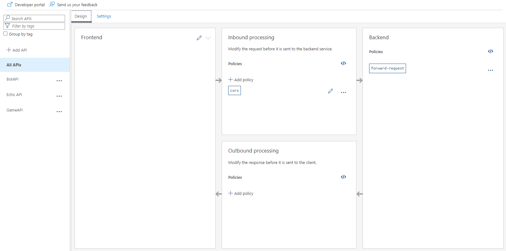
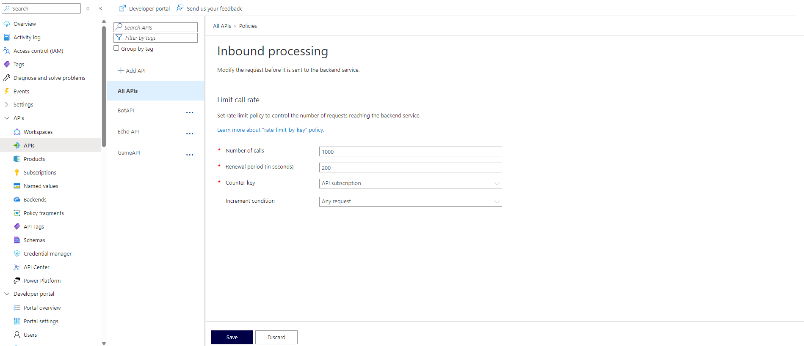

# Exercise 2
In this exercise you will establish secure links between the client side and APIM and between the APIM and the APIs using SSL Termination. You will find out how rate throttling works if you wish to track or limit the number of requests to your APIs. 

## Estimated time: 45 minutes

## Learning objectives
   - Implement API Management
   - Configure SSL termination  
   - Implement rate throttling
## Prerequisites
For this exercise, you will need the following PowerShell variable used previously:
- $StaticWeb - name of your Static Web App resource
## Step 1: Deploy Azure API Management(APIM)
```powershell
$PublisherName="<publisher-name>"
```
```powershell
$APIM="<apim-name>" 
```
```powershell
$PublisherEmail="<publisher-email>" 
```
- `<publisher-name> = Name your publisher`
- `<apim-name> = Name your api management`
- `<publisher-email> = Enter your publisher email`

The publisher email is used for recieving notifications about API subscriptions. It won't be used for this exercise but you need to set it in order to create the resouce.

```powershell
az apim create --name $APIM --resource-group $EmailResourceGroup --publisher-name $PublisherName --publisher-email $PublisherEmail
```
## Step 2: Redeploy the apps
Now that you deployed the API Management resource, you will need to deploy the new version of the APIs. This version contains a schema with the OpenAPI specifications of the API's so that when you'll import them into the APIM, the endpoints will be automatically generated for you without the need of importing or manually adding them.

The Web Application will also change as it will now call the common endpoint of the APIM resource, instead of using the respective endpoints of each API.

```powershell
az containerapp up --name $GameApi --resource-group $APIResourceGroup --image casianbara/gameapi-rockpaperscissors:module2-ex2 --env-vars GAME_API_SIGNALR=$SignalREndpoint GAME_API_BOTAPI=$BotContainerUrl GAME_API_HOST=$GameContainerUrl GAME_API_SMTPSERVER=$SMTP GAME_API_SMTP_SENDER=$Sender
```
```powershell
az containerapp up --name $BotApi --resource-group $APIResourceGroup --image casianbara/botapi-rockpaperscissors:module2-ex2 --env-vars BOT_API_SESSION_URL=$GameContainerUrl
```

## Step 3: Provision the APIs to the APIM resource
For this step you will need to open [Azure Portal](https://portal.azure.com/), on the APIM resource that you created on Step 1. 
 1. Open the **APIs** tab, where you can add an API to your APIM. Select Container App as your option.


 2. Browse and select the bot container API you created in Module 1. The fields should auto-populate, except for **API URL suffix**, where you should enter the value `bot`


 3. After adding your bot API container app, select it and go to the **Settings** tab where you need to disable **Subscription Required**


 4. Repeat the steps to add your game API container as well. For the **"API URL suffix"** field, enter `game` for the game container API.
## Step 4: Add CORS to the APIM resource
To ensure that only your Web Application will be able to access the APIs, you should add CORS to the APIM resource.

 1. Add CORS to APIM by selecting **All APIs** and adding a policy on the **Inbound Processing card**



 2. Select **CORS** policy and add your static web url to **"Allowed Origins"** field then press the save button.


## Step 5: Redeploy static web app with APIM url

```powershell
$APIMUrl="<your-apim-url>"
```

- `<your-apim-url> = your Gateway url from APIM`

```powershell
az staticwebapp appsettings set --name $StaticWeb --setting-names "GAMEAPI_URL=$GameContainerUrl" "APIM_URL=$APIMUrl"
```

## Step 6: Implement SSL Termination 
Now you can secure the traffic of your API by enabling SSL Termination for the APIM.
1. Navigate to your APIM resource

2. Go to **Protocols + ciphers** under **Security** tab and **enable SSL** for both **Client protocol** and **Backend protocol**. Make sure to click **Enable** before saving.After that, press the **Save** button.


Now the traffic will be secure, making the data unreadable if it's intercepted.

## Step 7: Implement rate throttling

In order to implement rate throttling for the APIs inside your APIM resource, you need to add a policy.

- On the **APIs** tab, select either the bot or game API, or select both by choosing **All APIs**. Then, add a **rate-limit-by-key** policy, completing the fields with values for rate throttling as shown in this example:



After implementing rate throttling, the endpoint(s) of the API(s) you selected will have a limit of how many requests can be made by someone in the period of time that you set.
