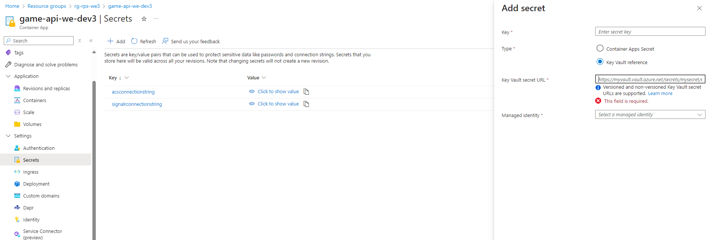

# Module 6: Microservices Arhitecture
In this module, you will learn how to securely manage sensitive information and monitor the performance of your containerized applications in Azure.

You will start by exploring secrets management using Azure Key Vault. You will learn how to securely store critical data like API endpoints and configure access controls using Managed Identities. By the end of this part, you’ll understand how to keep your application secrets safe and integrate them into a containerized environment.

Next, you’ll dive into logging and monitoring using Azure Monitor and Azure Storage. You’ll set up diagnostic settings to capture application logs, store them in a secure location, and learn how to access and analyze these logs. This will help you monitor your app’s health and troubleshoot issues effectively.

# Exercise 1
In this exercise, you will create an Azure Key Vault to securely store API endpoints as secrets, assign appropriate access roles, and set up a Managed Identity. You will then link these secrets to a game API container, ensuring the environment variables are securely configured, and deploy the containerized game application using Azure CLI.

## Estimated time: TODO minutes

## Learning objectives
   - Create and Configure Azure Key Vault
   - Assign Roles for Secure Access
   - Manage and Add Secrets to Key Vault
   - Set Up Managed Identity for Secure Access
   - Use Secrets in a Game API Container
   - Deploy and Configure a Container Application

## Prerequisites
During this module you will also need 7 of the PowerShell variables used previously:
   - $SignalREndpoint - SignalR connection string
   - $APIResourceGroup - name of the Resource Group in which you have your Container APIs and Static Web App, from the first region
   - $SMTP - SMTP connection string
   - $GameApi - name of the Game Container API deployed in the first region
   - $Sender - Azure Managed Domain MailFrom address
   - $GameContainerUrl -  URL for your Game Container API
   - $BotContainerUrl - URL for your Bot Container API

## Step 1: Create an Azure Key Vault
First, we need to create an Azure Key Vault. Use the following PowerShell script:

```powershell
$KeyVault="<key-vault-name>"
```
```powershell
az keyvault create --name $KeyVault --resource-group $APIResourceGroup
```
- `<key-vault-name> = Use your desired name for Azure Key Vault`

## Step 2: Assign Roles for Key Vault Access
Next, we’ll assign the necessary roles to allow access to the Key Vault.

1. Define your subscription information:
```powershell
$SubscriptionUPN="<subscription-upn>"
```
```powershell
$SubscriptionId="<subscription-id>"
```
- `<subscription-upn> = Your subscription UPN (UserPrincipalName)`
- `<subscription-id> = Your subscirption Id`

2. Create a role assignment for Key Vault Secrets Officer:
```powershell
 az role assignment create --assignee $SubscriptionUPN --role "Key Vault Secrets Officer" --scope "/subscriptions/$SubscriptionId/resourceGroups/$APIResourceGroup/providers/Microsoft.KeyVault/vaults/$KeyVault"
```

## Step 3: Add Your Endpoints as Secrets to the Key Vault
Now, let's store your endpoints as secrets in the Key Vault:
1. Add the SignalR endpoint as a secret:
```powershell
az keyvault secret set --name SignalR --vault-name $KeyVault --value $SignalREndpoint
```
2. Add the ACS (SMTP) endpoint as a secret:
```powershell
az keyvault secret set --name ACS --vault-name $KeyVault --value $SMTP
```

## Step 4: Create a Managed Identity and Assign Roles

Create a Managed Identity using the following script:

```powershell
$Identity="<managed-identity-name>"
```

- `<managed-identity-name> = Name your Managed Identity name`

```powershell
 az identity create -g $APIResourceGroup -n $Identity
```

Using [Azure Portal](https://portal.azure.com/):
- Navigate to Azure role assignments.
- Create a new role assignment for the Key Vault named **Key Vault Secrets Officer** and assign it to your Managed Identity.


## Step 5: Use Key Vault Secrets in the Game API Container

1. Using [Azure Portal](https://portal.azure.com/):
- Go to the **Secrets** section under the settings tab of your Key Vault.
- Add a secret named **acsconnectionstring**.
    - For the Key Vault Secret URL, copy the URL of the ACS secret you created.
    - Link it to the Managed Identity created in the previous step.
- Repeat the process for **signalrconnectionstring** to add your SignalR endpoint secret.




2. Finally, use this command to apply the secrets as environment variables for your game API container:

```powershell
 az containerapp up --name $GameApi --resource-group $APIResourceGroup --image casianbara/gameapi-rockpaperscissors:module2-signalr --env-vars GAME_API_SIGNALR="secretref:signalrconnectionstring" GAME_API_BOTAPI=$BotContainerUrl GAME_API_HOST=$GameContainerUrl GAME_API_SMTPSERVER="secretref:acsconnectionstring" GAME_API_SMTP_SENDER=$Sender
```
